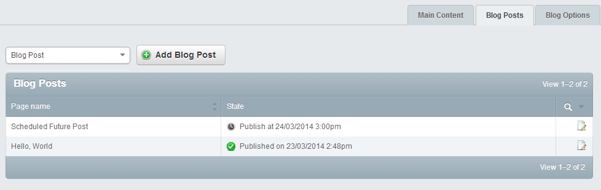
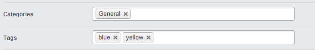

Silverstripe Blogger
====================

[](https://travis-ci.org/micmania1/silverstripe-blogger)

A fresh take on blogging in Silverstripe set out to tackle the issue of a cluttered Site Tree.


## Requirements
```
silverstripe/cms: ~3.1
```

## Suggested Modules
```
silverstripe/widgets: *
silverstripe/comments: *
```


## Installation

```
composer require micmania1/silverstripe-blog:1.0.*
```


## Features
* Blog Posts extend SiteTree so no Page functionality is lost by using DataObject's.
* Blog Posts can be listed in the SiteTree **OR** in a GridField within the blog, removing clutter for large blogs.
* Filter blog posts by category
* Filter blog posts by tag
* Full blog Archive by Year, month or day
* 4 widgets included (category listing, tag listing, archive & recent posts).
* Publish Date - Set a blog post to publish in the future.
* Custom GridField components for quickly adding new objects.
* RSS Feed of the blog


## Screenshots
*Easily manage and add new blog posts through a GridField.*


*Quickly add new tags and categories.*



## Usage
Because the blog is part of the SiteTree the usage is the same as any other page.

By default, blog posts are filtered out of the SiteTree to avoid clutter and instead put in a GridField inside of the blog. If you wish to display the blog posts within the site tree you can do so using Silverstripe config.

**YAML**
```
BlogPost:
  show_in_sitetree: true
```

**PHP**
```
<?php
Config::inst()->update("BlogPost", "show_in_sitetree", true);
```

Doing this will remove the GridField & result in a normal behaving SiteTree.


## Theme
You can download a blog sub-theme of Silverstripe's default 'Simple' theme: https://github.com/micmania1/simple_blog