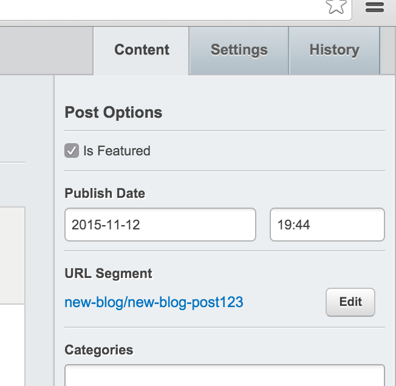

# Featured posts

You can enable featured posts with the following config:

```yaml
---
Name: featured-posts-blog-config
---
Blog:
  extensions:
    - BlogFeatureExtension

BlogPost:
  extensions:
    - BlogPostFeatureExtension
```

This will enable a checkbox in the CMS, with which you can feature blog posts:



By default, the template will show the most recent featured post at the top of the
list of posts in a blog. This post will be removed from the normal list of blog posts.
You can increase the number of specially-displayed feature posts by modifying the
template to show more, and by changing the following config setting:

```
<% if $CanHaveFeaturedBlogPosts && $FeaturedBlogPosts %>
	<% loop $FeaturedBlogPosts.Limit(10) %>
		<% include FeaturedPostSummary %>
	<% end_loop %>
<% end_if %>
```

```yaml
BlogFeatureExtension:
  excluded_feature_posts: 10
```
