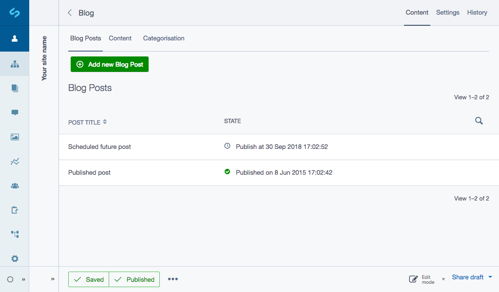

# Features

* Blog Posts extend SiteTree so no Page functionality is lost by using DataObject's.
* Blog Posts can be listed in the SiteTree **OR** in a GridField within the blog, removing clutter for large blogs.
* Filter blog posts by category
* Filter blog posts by tag
* Full blog Archive by Year, month or day
* 4 widgets included (category listing, tag listing, archive & recent posts).
* Publish Date - Set a blog post to publish in the future.
* Custom GridField components for quickly adding new objects.
* RSS Feed of the blog

## Screenshots

*Easily manage and add new blog posts through a GridField.*

*Quickly add new tags and categories.*

