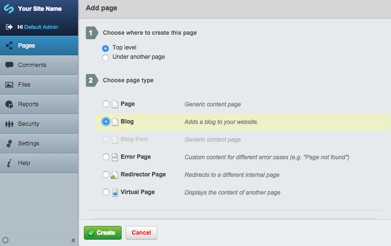
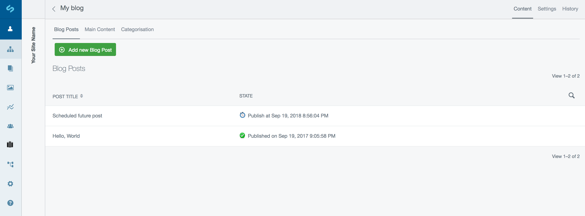
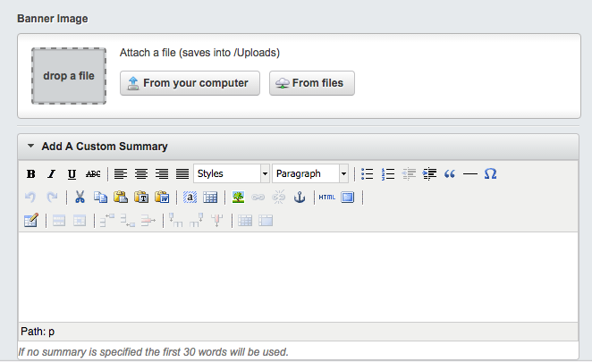
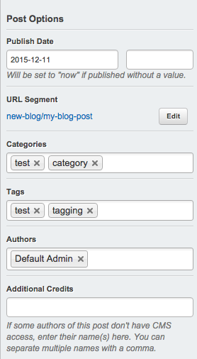

title: Adding a blog post
summary: How to add a new blog post.

# Adding a blog post

## Creating a new blog

On the top of the Contents pane, you will find a button marked "Create."  Click it, and a drop-down menu will show up. Select "Blog", then hit the "Go" button.

You will notice that a new blog page has been created, with the name of "New Blog". Rename this to "Blog" (or whatever you wish to call this page) and then you can later reorder where this is in your website tree.

Click on the new blog page to start creating posts.

## Creating a blog post

To create a blog post, click on your Blog page in the Page Tree in the site-tree Pane. You will see a list of past blog posts and a green button reading "Add new Blog Post", click this to add a new post.

Fill out your blog post content as you would any page in the CMS. 

You can also include a banner images and a custom summary description (if this is omitted the first 15 words of your post content will be used when displaying your posts's abstract).

There is a new right hand panel where you can set a publish date, categories, tags and authors.

