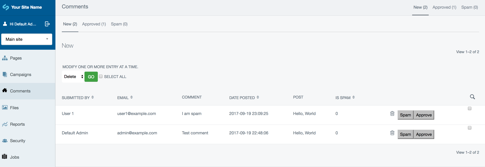

# Managing comments

**This guide assumes you have the optional [Comments](https://addons.silverstripe.org/add-ons/silverstripe/comments/) module installed**

If comments have been enabled on your website you will be able to moderate comments. You can access all comments through the left navigation
item title "Comments" or on a per blog post basis in the "Comments" tab when editing a blog post.

As new comments are made they show in the "New" tab. From here you can opt to approve comments or mark a comment as spam.

