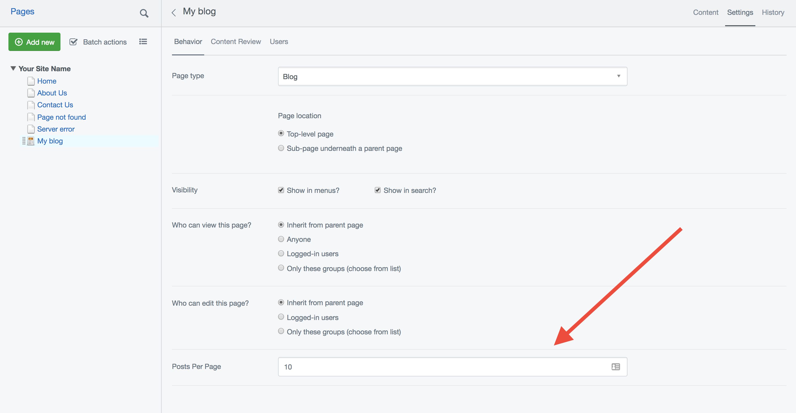

# Pagination

By default your Blog will display ten posts per page. The number of posts per page is configurable via the "Settings" tab. Setting posts per page to zero will disable pagination, displaying all of your posts on a single page.

