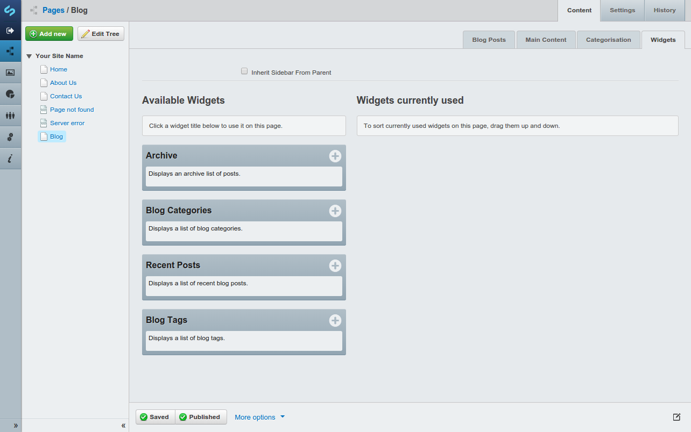

# Using Widgets

**This guide assumes you have the optional [Widgets](https://addons.silverstripe.org/add-ons/silverstripe/widgets/) module installed**

To add a widget - simply click the *plus* icon and the widget will appear in the "Widgets currently used" column.

After you've finished adding widgets, publish your blog, and your freshly minted widgets will appear in your blog's sidebar.

## Available blog widgets

### Archive

The archive widget helps you keep historical content relevant, by generating a list of posts, ordered by month or year.

### Blog Categories

The blog categories widget lets your readers easily find the content they're interested in.

### Recent Posts

The recent posts widget is great for providing quick links to your latest content.

### Blog Tags

Similar to the blog categories widget, blog tags help your readers find relevant content, at more fine grained level.

## Optional extra widgets

Additional widgets can be installed alongside your blog. 

 * [Content Widget - Display HTML content in a widget](https://github.com/silverstripe-labs/silverstripe-content-widget)

