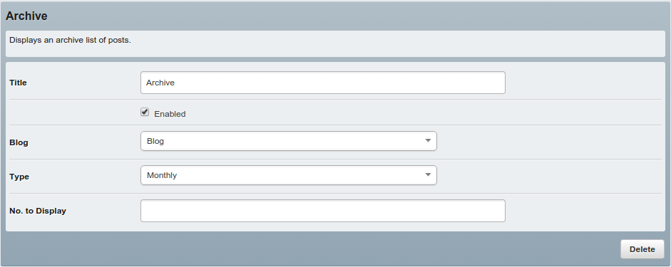
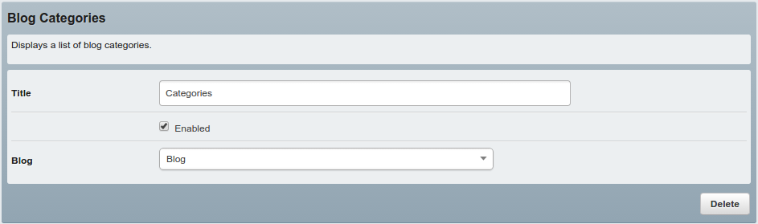
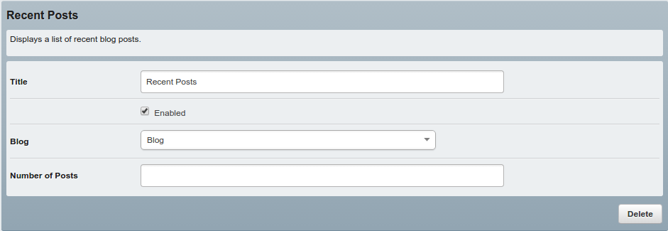
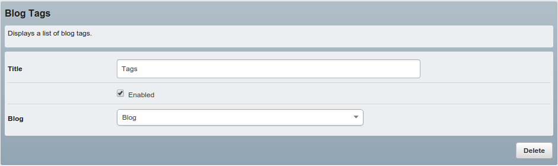

# Widgets

The blog module comes bundled with some useful widgets. To take advantage of them, you'll need to install the [SilverStripe widgets module](https://github.com/silverstripe/silverstripe-widgets). Widgets are totally optional - so your blog will work just fine without having widgets installed.

You can enable the widgets by adding the following YML config:

```yml
Blog:
  extensions:
    - WidgetPageExtension

BlogPost:
  extensions:
    - WidgetPageExtension
```

Once you have widgets installed you'll see the "Widgets" tab in the content section of your blog.


To add a widget - simply click the *plus* icon and the widget will be appear in the "Widgets currently used" column.

After you've finished adding widgets, publish your blog, and your freshly minted widgets will appear in your blog's sidebar.

## Archive

The archive widget helps you keep historical content relevant, by generating a list of posts, ordered by month or year.



## Blog Categories

The blog categories widget lets your readers easily find the content they're interested in.



## Recent Posts

The recent posts widget is great for providing quick links to your latest content.



## Blog Tags

Similar to the blog categories widget, blog tags help your readers find relevant content, at more fine grained level.


